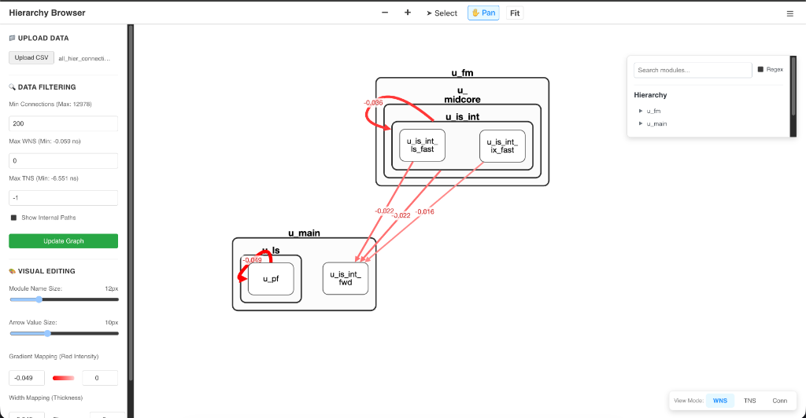

# VLSI Hierarchy Browser

The **Hierarchy Browser** is a specialized visualization tool tailored for VLSI (Very Large Scale Integration) engineers. It transforms flat connection data (CSV) into an interactive, hierarchical node graph, allowing engineers to visualize signal flow, timing violations (WNS/TNS), and module connectivity across complex chip designs.



## 🚀 Key Features

*   **Hierarchical Visualization**: Automatically nests sub-modules (e.g., `u_core/u_cache`) into parent containers to mirror the actual RTL structure.
*   **Timing Heatmaps**: Instantly spot critical paths.
    *   **Red Intensity**: Indicates Worse Negative Slack (WNS).
    *   **Edge Thickness**: Represents signal count or connection strength.
*   **Interactive Filtering**:
    *   Filter by **Slack** (WNS/TNS) to isolate timing violations.
    *   Filter by **Connectivity** to ignore minor control signals.
*   **Deep Inspection**:
    *   **Isolate Mode**: Focus on one module and its immediate neighbors.
    *   **Search**: Regex-supported search to jump to specific instances.
*   **Zero-Install Sharing**: Deployable as a static web app or a standout double-click application.

## 📥 Data Format (Input)
The tool accepts a **CSV file** with the following required columns. Each row represents a connection (edge) between two hierarchical pins or modules.

| Column Name | Description | Example |
| :--- | :--- | :--- |
| `hier` | Source module path (Hierarchical) | `u_top/u_core/u_alu` |
| `connnecting_hier` | Target (Destination) module path | `u_top/u_mem/u_cache_ctrl` |
| `connections` | Number of signals/bits in this link | `32` |
| `direction` | Signal direction | `to` or `from` |
| `wns` | Worst Negative Slack (Timing) | `-0.45` |
| `tns` | Total Negative Slack | `-12.5` |

*(Note: The `desc` column is optional but helpful for tooltips.)*

## 🛠️ Usage

### Quick Start (Pre-built)
If you have received the `dist` folder:
1.  **Mac**: Double-click `Run_App.command`
2.  **Windows**: Double-click `Run_App.bat`
3.  **Linux**: Run `./start_server.sh`
4.  The app will open at `http://localhost:8000` (or similar).

### Development
1.  Install Node.js (v18+).
2.  Clone the repo:
    ```bash
    git clone https://github.com/guptaaryan0405/Hierarchy-Browser.git
    cd Hierarchy-Browser
    ```
3.  Install dependencies:
    ```bash
    npm install
    ```
4.  Run locally:
    ```bash
    npm run dev
    ```

## 🏗️ Deployment
To build for production (creates the `dist` folder):
```bash
npm run build
```
See [DEPLOYMENT.md](./DEPLOYMENT.md) for full server hosting instructions.

## 🤝 Contributing
See [DEVELOPMENT.md](./DEVELOPMENT.md) for internal workflow and architecture details.
